#Biomes
The Above is divided into several biomes just like the Overworld, but each island represents a different biome
Biome Name|Description|Image
----------|-----------|-----
The Hills|The hills is the central island of the above.  It is the drop point and contains Jenner's Airship.|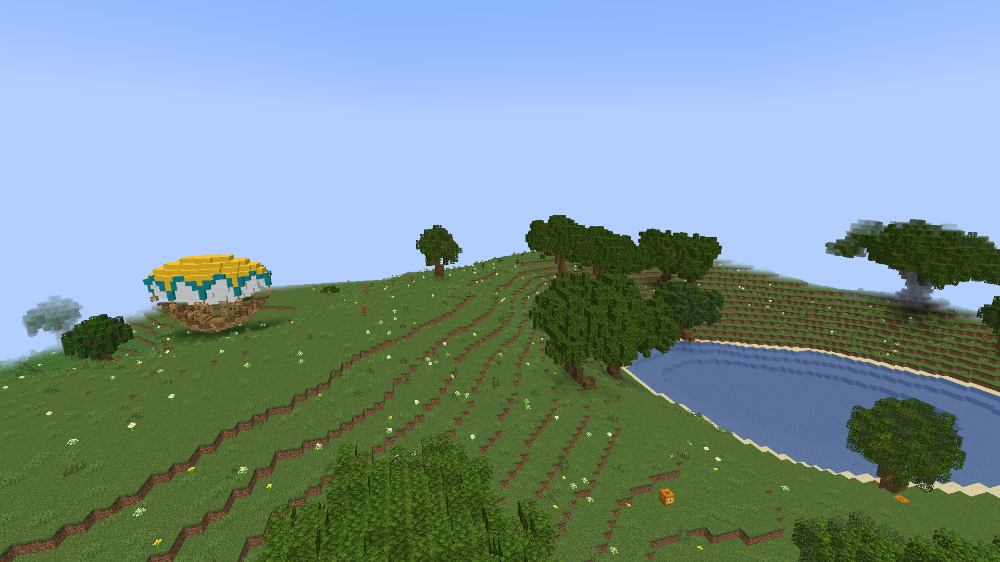
The Swamp|The Swamp is on the west side of the Above, and contains the witch hut, which is where Gremora spawns.|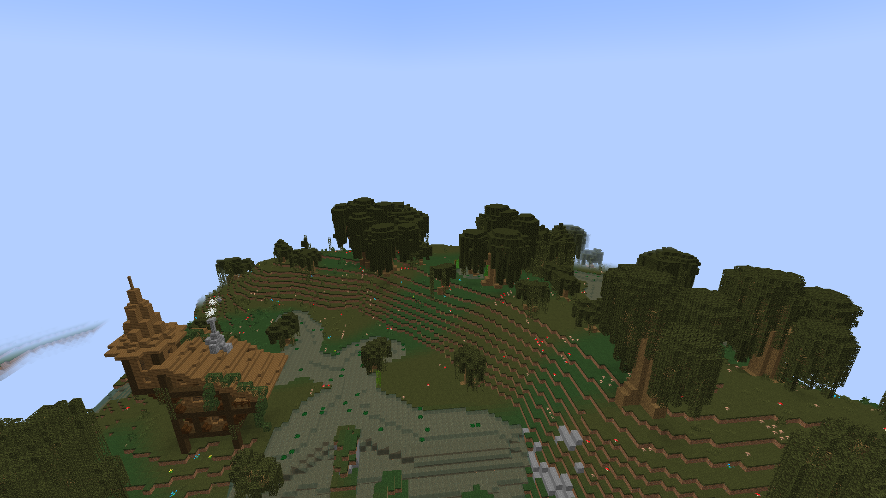	
The Savanna|The Savanna is on the east side of the Above, and contains some parked cars, which is where Von Fiend spawns.|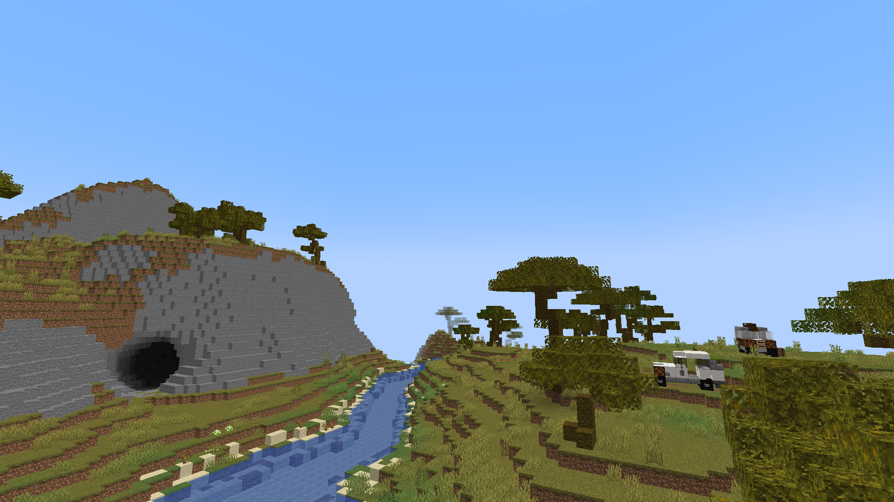	
The Lake|The Lake is on the south side of the Above, and hidden under the Lake lies a pirate cave.|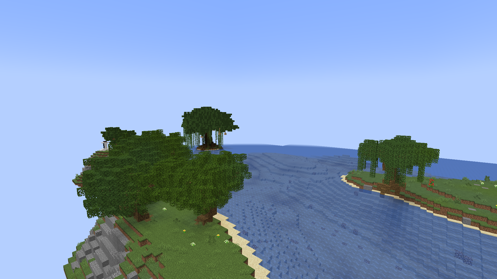	
The Snowy Mountain|The Snowy Mountain is on the north side of the Above, and contains an icy cave system under its mountains which is where Kermode spawns, and a cave containing the boat races.|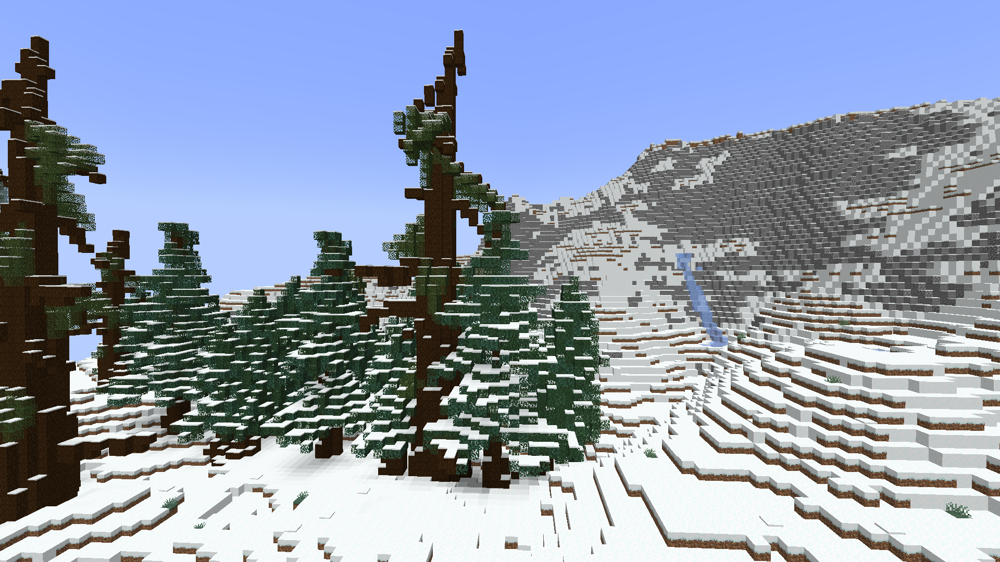	
The Flower Forest|The Flower Forest biome is on the north east corner of the Above, and shares an island with The Savanna. It contains a lot of bee nests and a honey cave which is where the Bee Queen spawns.|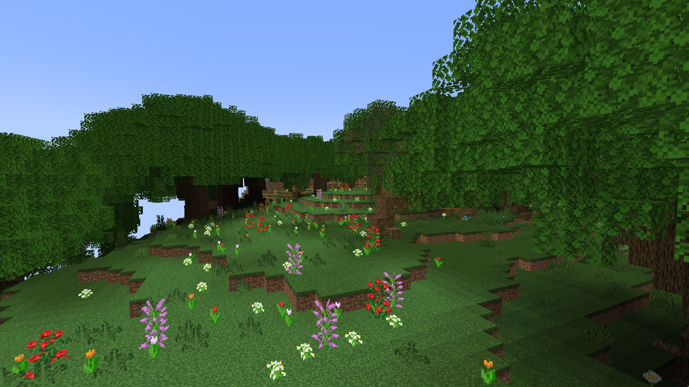	
The Forest Hill|The Forest Hill is on the north west side of the Above, and contains a spider cave full of cobwebs, the main entrance to Broodmother’s cave.  There is also an entrance to the cave system. The nearby hills contain a river of gold said to heal curses.|	
The Desert|The Desert is on the south side of the Above. The Desert contains one of the entrances to the cave system, and a pyramid that is currently not open.|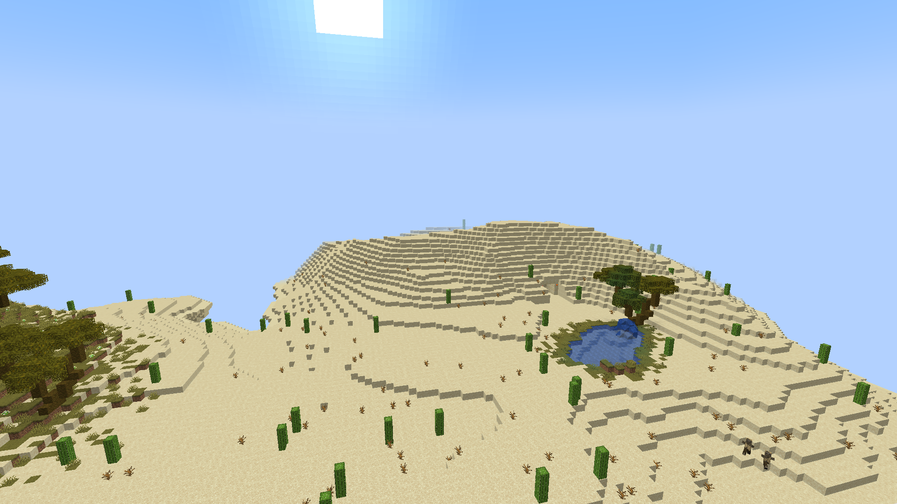	
The Mesa|The Mesa is south side of the Above. The mesa biome contains a U.F.O on the south part, and a cave full of knockback spiders.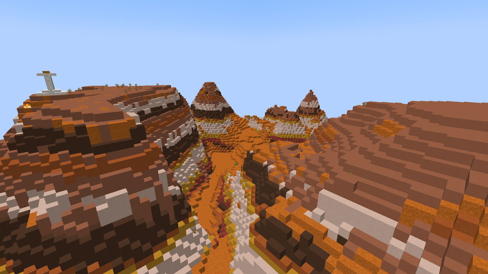	
The Volcano|The Volcano is on the south west side of the above.  It is a large volcano with deep pools of lava.  Some pools have treasure at the bottom.  The Volcano also houses Midas' lair.|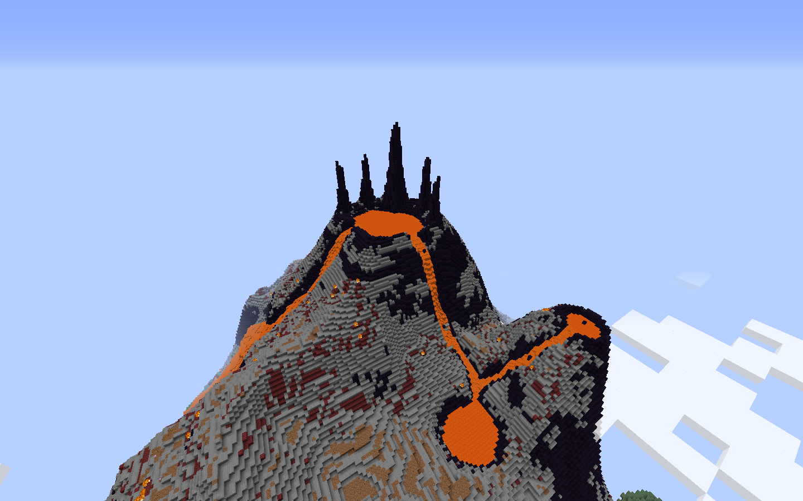	
The Jungle|The Jungle is on the west side of the above.  There are currently no encounters of interest here.|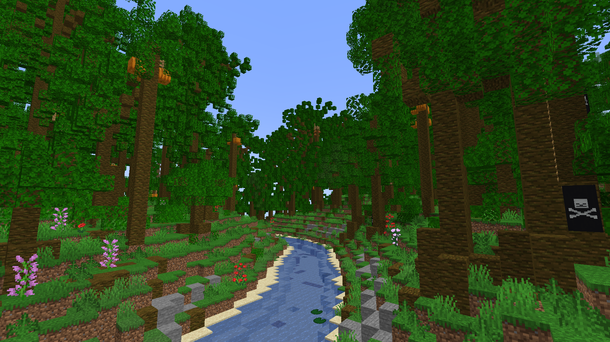	
Pig Race Island|This Mixed Biome island is in the far south east of the Above. This island is the race ground of the pigrace.  Just off the east of this island is Kovic's island.|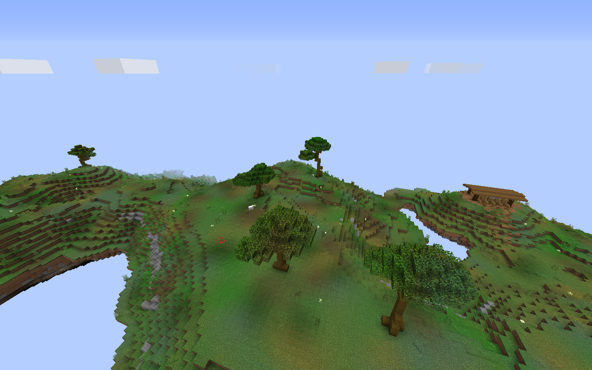	
The Dark Oak Forrest|The Dark Oak Forrest is in the east south east side of the above.  It contains a resetting Mansion.|
The Mushroom island|The Mushroom island is in the east side of the Above.  There are no encounters of interest here|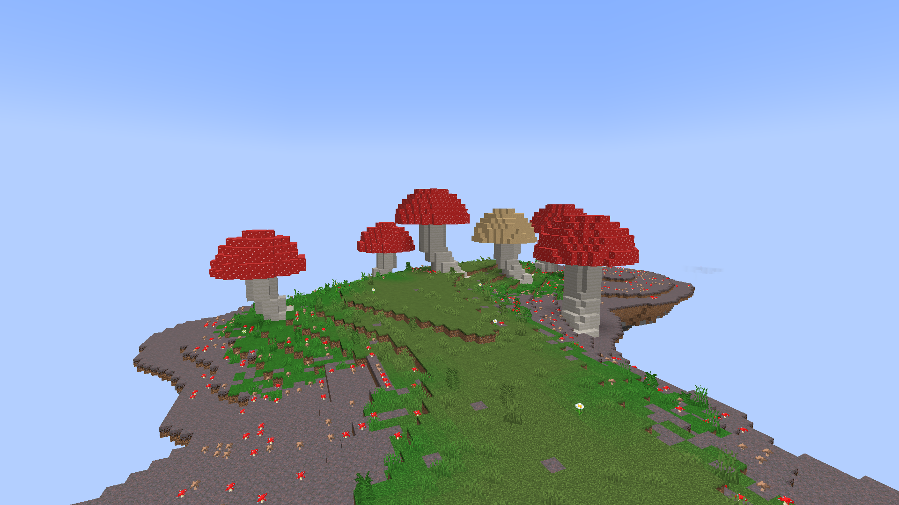	
The Cave System|This sprawling cave system maze stretches across the Above.  There are entrances on several islands and notably contains a backdoor to the Broodmother's cave.|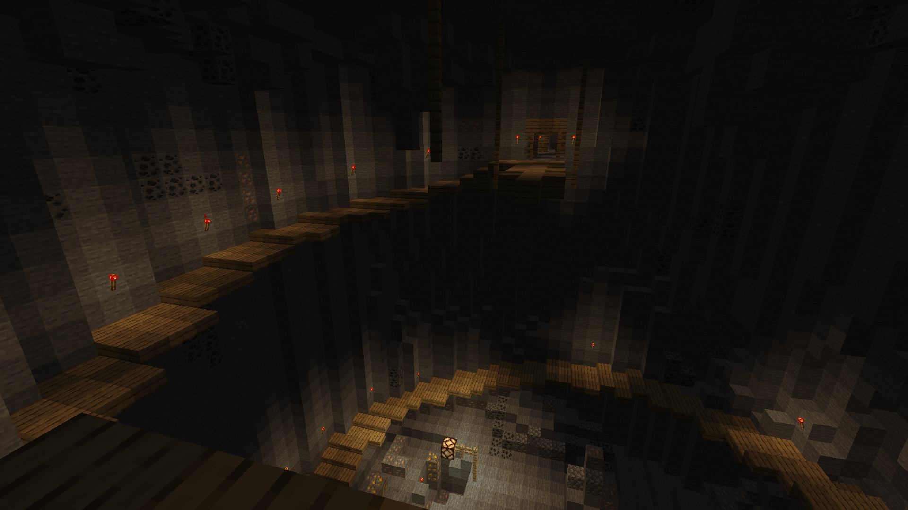	
