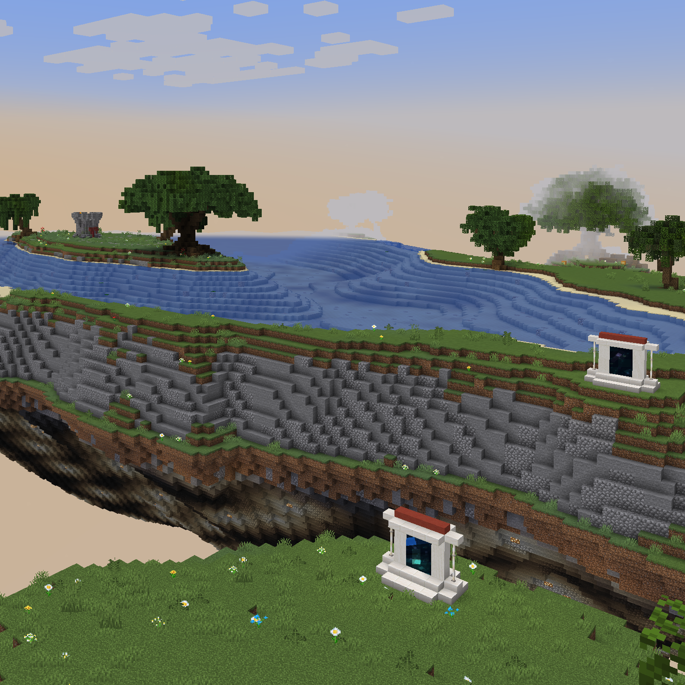

# Bosses

The Above contains a multitude of boss monsters, who drop the coveted Titan Shards upon defeat.

## Bee Queen

The Bee Queen spawns in the Flower Forest biome. She is not very strong compared to other bosses, but she makes up for that by having a literal swarm of soldier bees that will attack any player or creature nearby. If a player manages to kill only the Queen and not the servants they will achieve the [Clean Coup](advancements.md#clean-coup) advancement.

**Strategy:** kill the queen bee, FAST. highly suggest entering to the hive full gear and with totems.

**Difficulty Level:** Medium

**Rewards:** 1 Titanshard, 1 stack of Wither Roses

## Von Fiend

Von Fiend spawns in the Savanna biome near the cars. He is a supernaturally buff Vindicator that has a huge number of hit points and hits hard enough to kill a player in two hits. Von Fiend is also skilled, as he only kills his enemies by chopping their head clean off. When a player is murdered by Von Fiend for the first time they will achieve the [Off with your head!](advancements.md#off-with-your-head) achievement. When von Chop the players head of he will hold that head in his hand, and when picking up a new head it will replace the one he was currently carrying. The head which Von holds upon death will drop on the ground and the player could pick it up.

**Strategy:**

- Attack from a short tree and whack a Von with your sword until he dies.
- Make Von chase you inside the river, it will slow him down and make him an easier target.

(arrows do no damage)

**Difficulty Level:** Hard 

**Rewards:** 4 Titanshards, Head Hunter Axe

## Gremora

Gremora spawns inside the witch hut in the Swamp biome. While Gremora is active, normal witch mobs will spawn in and around her hut and are hostile to the player. When engaged she will do the usual witchy thing of tossing Potions of Poison--but what makes her unique is her ability to teleport after taking a certain amount of damage, leaving a Lingering Potion of Slowness in her wake. Gremora's ability to teleport to a random spot inside or outside the hut gives her time to drink Potions of Healing to restore her massive HP pool. Since the player is slowed down, it becomes difficult to catch up to her before she fully heals.

**Strategy:**

- It is a very hard battle, first time fighting should be with a group of players while each player on different level of the witch hut.
- Strength II pots and Spectral arrows to know the location of Gremora when she teleports.
- Healing, Regeneration, food, full armor, totems suggested because Gremora and her witch minions deal a lot of damage.
- Ender pearls to get to her faster when slowed down by her slowness pots.

A player that kills Gremora alone will achieve the [It Cost Everything](advancements.md#it-cost-everything) achievement.

**Difficulty Level:** Hard

**Rewards:** 

- 2 Titanshards
- Occasionally 1 random Above potion with a unique effect
- ~64 of a regular witch drop such as glowstone dust or sticks

## Volt

Volt spawns in his own little island just south of the central spawn island. He is an iron golem infused with the power of ELECTRICITY allowing him to zap players, spawn charged creepers, and move at lightning speeds. Due to the nature of the fight, it is easy to get killed immediately after a totem pop. Volt has several different custom attacks, including hurling the player up into the air, leaping into the air and stomping on the player, summoning lightning bolts, and charging creepers.

Getting hit by one of his lightning bolts grants the achievement [thunder struck](advancements.md#thunder-struck).

Luckily, Volt is still an iron golem and as such has AI that the player can use to their advantage: he will always prioritize attacking hostile mobs, including phantoms. This can help give the player time to recover from his fast, unrelenting damage output.

**Recommended gear:**
- Chestplate!!!
- blast protection is another idea for the creepers, need to test further.
- Ender pearls are a must to mitigate fall damage when he tosses you up.
- Bow and spectral arrows, he's vulnerable to arrow damage and a fully drawn power 5 spectral shot should 1-shot a charged creeper.
- Sharp 5 sword/axe.
- Potions of regen, strength, and speed.
- Many many totems.

**Strategy:**
- Volt will attack hostile mobs first like any normal golem, so night time could come in handy.
- Make sure to do preparations before the fight, you won't have time to do that when landing on his island.
- Creepers do lots of damage, be sure not to get hit by their explosion while fighting. Even if the explosions don't 1-shot you they do a lot of durability damage and no one likes that.
- Volt will begin to show signs of damage like a regular golem to show his health.
- One way is to melee him, or try to get him by arrows and elytras but that would cost a lot of rockets.
- Pearls are necessary when volt lunches the player to the air to avoid massive fall damage, and to get away from volt to eat to regen or consume more potions.
- Friends to help take him down quicker is always a good idea, Especially if it's the first time you fight volt.
- For the first time suggested to use backup gear because the creepers could blow up everything after the player death.

**Difficulty Level:** Very hard

**Rewards:**
- 4 Titanshards
- 1 SpEciAL Poppy

## Kermode

Kermode spawns in the Snowy biome inside of a cave. I don't have much to say here, she's a bear. She mauls you. if a player defeats Kermode without a weapon that player gets the [With my Bear hands!](advancements.md#with-my-bear-hands) achievement. 

**Strategy:** There is not much strategy for this boss since he is pretty easy. Kermode is pretty fast and can do some damage when it hits the player. suggested shooting arrows from the entrance or full gear and strength II potion to make things faster.

**Difficulty Level:** Easy

**Rewards:**

- 1 Titanshard
- ~64 blue ice

## Broodmother

The Broodmother is a spider that makes her lair inside of a web-filled cave in the Forest biome. There are several entrances to her cave, allowing players a choice in how to approach the fight. The cave spawns cave spiders constantly, which amps up the difficulty of the fight. The Broodmother has seen fit to festoon her arena with cobwebs, which make it difficult to maneuver and fight her. 

**Difficulty Level:** Medium

**Rewards:**

- 3 Titanshards
- ~64 cobwebs

## Midus
Midus is a Piglin who turns everything he touches to gold.  He lives in a golden cave in the volcano.  If Midus hits you, he doesn't do damage, but rather, he turns 1 random item in your inventory or piece of equipped armor into gold.  If you run out of armor to be converted, you die.  Full stop.  No totems can save you from this.

Once you have been killed, a statue of yourself will appear in the foyer.  Clicking this statues Gold Block Head will give you all of the items you died with back.  Any items that have been turned to gold can be restored by throwing them into the golden spring over in the Spruce hills biome. 

  
Spoiler warning

## Specters

The staff has been turned into headless Specters. You'll find them in one of the Arena's scattered around the Above. They are passive mobs until you attack them, and then it's fight on! They are tough bosses and come at you with high speed. Upon death they drop their respective souls. Collect three different ones to earn the [Keymaster](advancements.md#keymaster) or the [Bond, James Bond](advancements.md#james-bond) advancement.

**Strategy:** Ranged attacks work. So a Punch II bow is really effective. Otherwise bring totems and if you can a friend.

**Difficulty Level:** Hard

**Rewards:** 1 Specter Soul

## The Fallen One

The Fallen One has returned for his revenge. After obtaining three different Spectre Souls, take them to the Fallen One's tower near the Volcano and offer them up one by one to get access to his Arena. After passing through the third gate you have time to prepare yourself for the fight ahead. Defeating the Fallen will earn you the [Break the Fallen](advancements.md#break-the-fallen) achievement. If you managed to deal the final blow at every stage you will earn the [GloryHog](advancements.md#gloryhog) achievement.

**Strategy:** Be prepared! Totems, Potions, Golden Apples. This is a three stage fight. You're gonna get hit, so make sure you can heal appropriately. This fight is not recommended to do alone. So bring friends, yes multiple!

**Difficulty Level:** Very Hard

**Rewards:** 3 Titanshards

# NPCs

## Victor

Coords: x: 50293, y: 93, z: 608

Victor is a quest giver located in a tower in the Lake biome to the south-east. After completing a quest you will receive the [Go Quest, Young Man](advancements.md#go-quest-young-man) advancement.

Quest Text: I've gotten word that there's an archaeologist trapped in one of the tombs in the desert. Just like one of those science hippies to get themselves in trouble and expect someone else to bail them out. Can you deal with it?

## Kovac

Kovac is a villager that spawns inside of the shrine at the far end of The Plains. He spawns as a zombie village full diamond gear, and when he is being converted back to village with a golden apple and a weakness potion the player will receive the [An Apple a Day](advancements.md#an-apple-a-day) advancement and be able to turn armor into chainmail armor. (more information needed). when cured Kovac will reward you with a titanshard.

## Beau

Possible Coords: x: 49735, y: 119, z: -176

Beau is a wanderer merchant that spawns in different locations every in game day during daytime. players can buy from Beau mini blocks (1 shard + specific block = 8 mini blocks), and when they do they get the [Its a small world](advancements.md#its-a-small-world) advancement, the [Second pickings](advancements.md#second-pickings) if a player buys something that wasn't sold last time, and if they buy everything they get the [Everything must go](advancements.md#everything-must-go) advancement.

## Jenner

Coords: x: 499940, y: 106, z: 404

Trades

- 1 Titan Shard -> Some Lost Stuff

Jenner is a merchant that is located in a blimp in the Hills biome.

