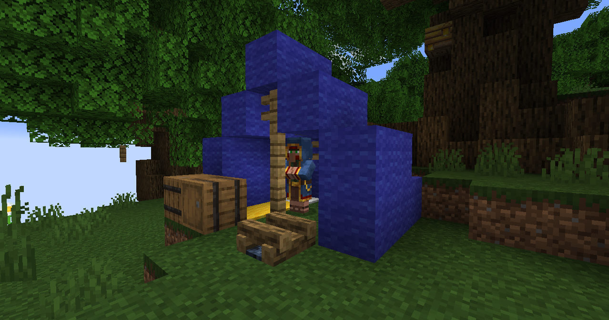

# Beau

Possible Coords: x: 49735, y: 119, z: -176

Beau is a wanderer merchant that spawns in different locations every in game day during daytime. Beau will not despawn if a player is nearby.

Players can buy from Beau mini blocks (1 shard + specific block = 8 mini blocks), and when they do they get the [Its a small world](advancements.md#its-a-small-world) advancement, the [Second pickings](advancements.md#second-pickings) if a player buys something that wasn't sold last time, and if they buy everything they get the [Everything must go](advancements.md#everything-must-go) advancement.

Trades are semi-randomly generated based on the inventory of the first player who interacts with them.  All trades are mini block versions of minecraft blocks.  All trades cost 1 titanshard and 1 block and yield 8 mini blocks based on that block.

It is unknown if there is any block that cant be made into a mini block this way.
