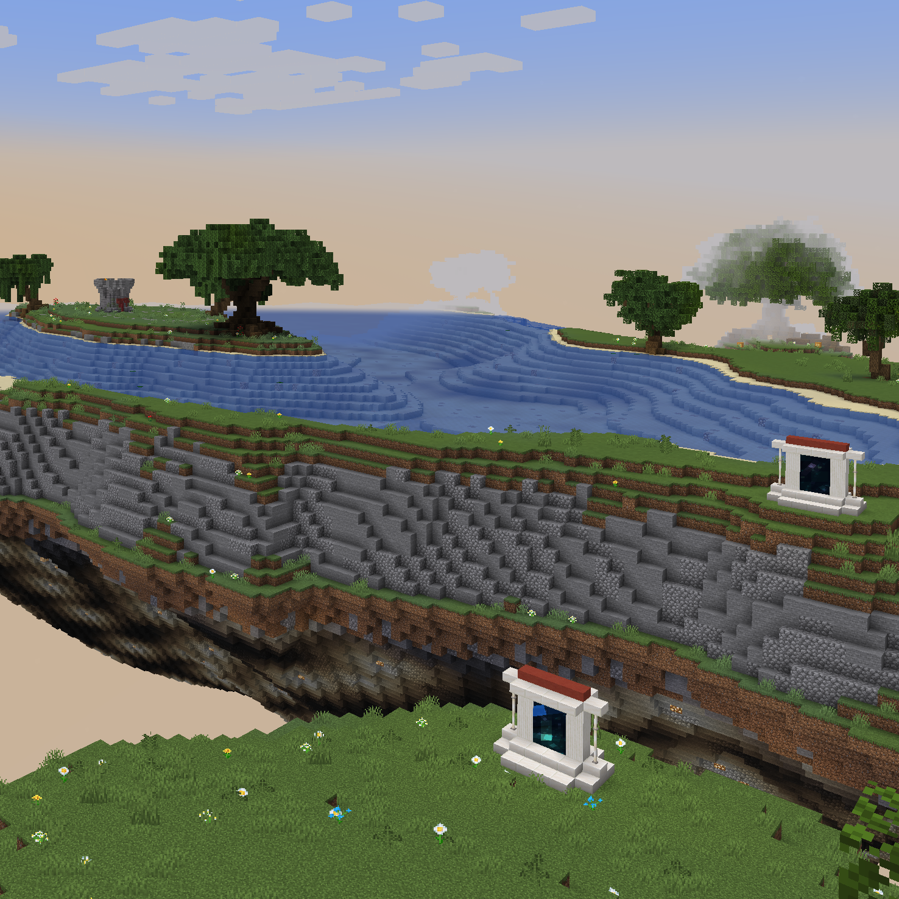

# Victor

Coords: x: 50293, y: 93, z: 608

Victor is a quest giver located in a tower in the Lake biome to the south-east. After completing a quest you will receive the [Go Quest, Young Man](../advancements.md#go-quest-young-man) advancement.

There are various quests.

## Archaeologist
Quest Text: I've gotten word that there's an archaeologist trapped in one of the tombs in the desert. Just like one of those science hippies to get themselves in trouble and expect someone else to bail them out. Can you deal with it?

## Rusty
Win Condition:
Find and defend Rusty the Iron golem who is currently under attack by iron headed skeletons in the snow biome.  Kill enough skeletons to fully repair Rusty with the iron they drop.
