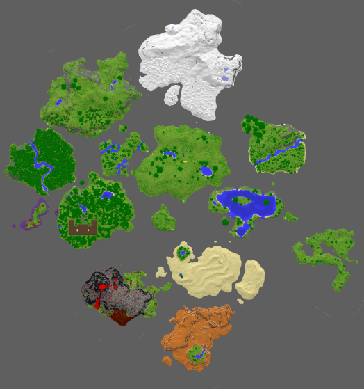
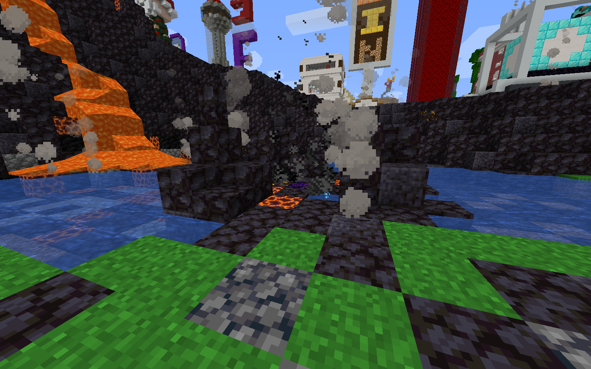
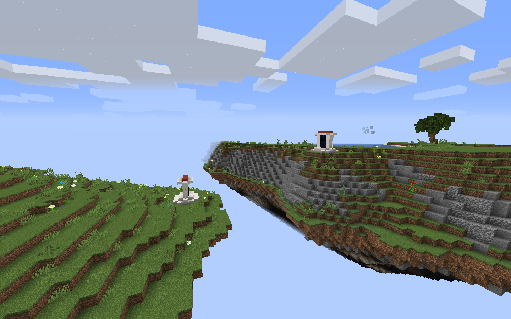
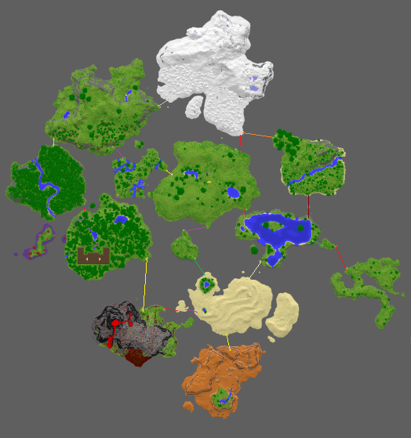

# The Above

The Above is a deadly dimension modded in Titancraft. The Above is filled with crazy landscapes, bosses, puzzles, and a horde of crazy strong hostile mobs. This guide is a community work based on the guide originaly created by avivg2001, Trollentia, and Arvital. This guide should be considered a work in progress, and as such has parts that need to be filled out and/or edited. If you are willing to contribute to the guide, or if you have any questions you may contact jamcdonald120 through Discord OR just create a pull request on the [github](https://github.com/Jamcdonald120/Titancraft-Above-Wiki/tree/gh-pages).
## Accessing

To access the Above, the player needs to stand in the middle of the wood shrine, in the under ground area of spawn.
## Traits
The Above is formed by a bunch of floating islands separated by the “Void”. A player which falls off into the void will be teleported to the Overworld, high in the sky over the Shopping District. The player will safely land in the ocean by the ship.  Note: items that fall into the void are lost.  Be cautions when aranging your inventory while falling and avoid dieing near the edge of an island.

The Above is Adventure Mode only, so players can't break or place any item or block there, but will be able to interact with chests, leavers, buttons etc.
Most creatures found in the Above are hostile and deadly.
No matter how far you will fly, when going back to the Overworld you will get back to the same place at spawn. 
The islands in the Above have teleport gates which allow a player on foot to move from island to island.  Each gate is color coded to its opposite and all gates are bi-directional. 

Here is a map that includes the gates.

## Environment
The Above features a unique terrain formed by biome-specific islands in the sky. Between the islands is a vast expanse of nothingness known as the Void.

## Table of Contense

[Biomes](biomes)

[Structures](structures) (under construction)

[Bosses](bosses) (under construction)

[Loot](loot) (under construction)

[Enchantments](enchantments.md) (needs update)

[Advancments](advancments.md) (under construction)

