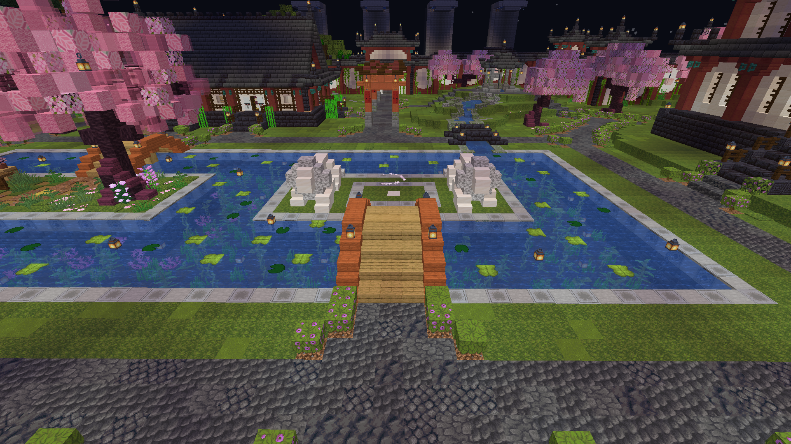

# The Above

The Above is a deadly dimension modded in Titancraft. The Above is filled with crazy landscapes, bosses, puzzles, and a horde of crazy strong hostile mobs. This guide was created by avivg2001, with Trollentia helping to fill out some of the information, and Arvital editing the document. This guide should be considered a work in progress, and as such has parts that need to be filled out and/or edited. If you are willing to contribute to the guide, or if you have any questions you may contact avivg2001 through Discord.
## Accessing
  

To access the Above, the player needs to stand in the middle of the geysir, which is marked by crying obsidian. Once the player stands on the crying obsidian, they will be launched to the Above, and will land in a lake to prevent fall damage. The geysir generates a sound effect of explosion when launching, but will deal no damage to the player.
## Traits
The Above is formed by a bunch of floating islands separated by the “Void”. A player which falls off into the void will be teleported to the Overworld, high in the sky over the Shopping District. The player will safely land inside the lake near the geysir.
The Above is Adventure Mode only, so players can't break or place any item or block there, but will be able to interact with chests, leavers, buttons etc.
Most creatures found in the Above are hostile and deadly.
No matter how far you will fly, when going back to the Overworld you will get back to the geysir at spawn. 
The islands in the Above have teleport gates which allow a player on foot to move from island to island.
  

## Environment
The Above features a unique terrain formed by biome-specific islands in the sky. Between the islands is a vast expanse of nothingness known as the Void.
##Table of Contense
[Biomes](biomes.md)

[Structures](structures.md)

[Bosses](bosses.md)

[Loot](loot.md)

[Advancments](advancments.md)

