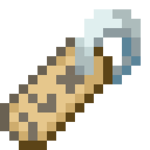

# Loot

## Titan Shard

{:width="64px"}

Titan Shards are obtained by defeating mob bosses or solving the Mansion puzzle. These Titan shards later can be traded in to get unique rewards, including weapons, armor, and equipment with impossible to craft enchantments! 

## Head Hunter Axe

{:width="64px"}

The Head Hunter Axe is obtained by defeating Von Fiend. This axe has 1 durability and is capable of one-shotting any normal mob in the game. Hitting a mob with it will destroy the axe, and reward the player with the head of the mob.

## Disappearing Potion

{:width="64px"}

Gives the player 15 mins of invisibility.

## Draught of deadliness

{:width="64px"}

Haste II (3:00)
When Applied +20% Attack speed.

## Blackness Brew

{:width="64px"}

blindness (5:00)

## Distilled Daylight

{:width="64px"}

Night vision (30:00)

## Salamander Serum

{:width="64px"}

Fire Resistance (30:00)

## BOOM stick

{:width="64px"}

Knockback X

## Coupons

{:width="64px"}

There are a variety of things coupons can do that players could not be able to do in vanilla survival. Each kind of coupon allows the player to do a diffrent thing, and when used they disappear. Most of the coupon can be redeemed in the Kiosk under the volcano pathway at spawn.

Name coupon: This coupon allows the player to rename an item using custom formatting and colors.

Enchantment coupon: This coupon allows the player to make an item looks enchanted

Banner coupon: This coupon allows the player to make a banner with more than just 6 patterns.

Mini-Block coupon: This coupon allows the player to get one custom head from the internet.

Lore coupon: This coupon allows the player to apply custom lore text to an item.

Armor stand coupon: allows the player to modify an armor stand as he wish (like Zombie-Cleo armorstand work but without the book and alot of coupons are needed)

Block coupon: allows the player to obtain a block that they wouldn’t be able to get in vanilla survival (must be accepted through mods first)

Book/sign coupon: allows the player to apply custom text on a sign or inside a book with different formats and colors.

Item frame coupon: allows the player to make Item Frames invisible…? I don't know what else

Mob modification coupon: allows the player to change a mob AI as they wish (for example removing their AI, making them passive ect…)

spawner coupons: allows the player to create a NON FUNCTIONAL spawner with any mob of their choice spinning in the center.

Armorstand, block, book/sign, Item frame, mob modification, spawner coupons cannot be redeemed automatically through 

## Power Potion

15 minutes of conduit

## Liberation Libation 

5 minutes HOTV

## Cannon Cola

Get transported to the above

## Dolphin’s Dose 

5 minutes Dolphin’s Grace

## Feather Philter

15 minutes of feather falling

## Luck

1 minute of luck

