# Structures

In the Above you'll encounter different structures, most structures will contain a puzzle for you to solve, a mini-game to play or a boss to fight.

## Blimp

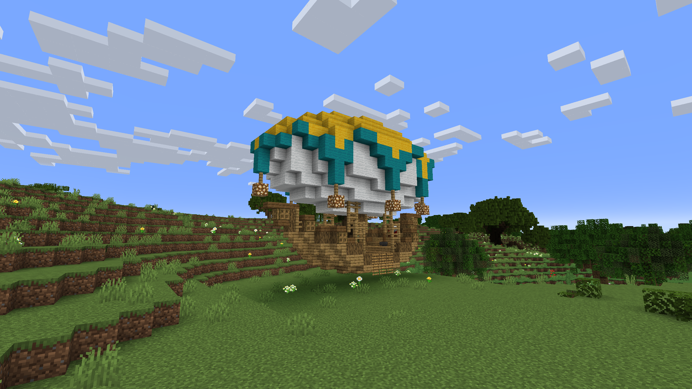

The Blimp is the first structure you will encounter. It's on the main island providing you with an Ender chest and your first NPC [Jenner](bosses.md#jenner). Here you can come to retreive lost gear after a death in the Above.

## Victor's Tower

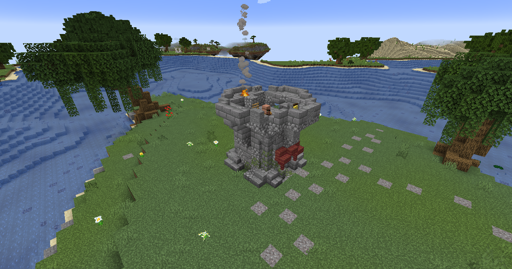

Victor's Tower is close to the main island. [Victor](bosses.md#Victor) lives here. He is a well known adventurer. However he is retired and now makes sure people in need receive the help they want. You can pick up special Above related quests.

## Pig Racing Pen

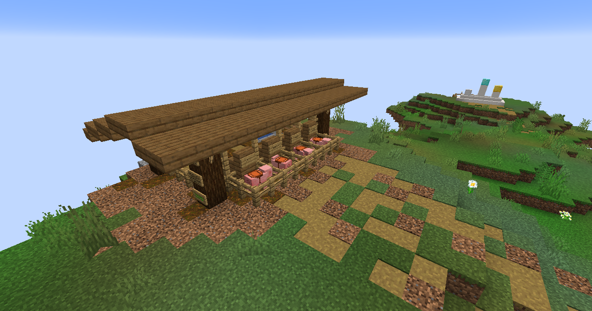

This pen will sometimes hold 4 different pigs. When it does, get your friends together. Each one of you chooses a pig and you race for as many points as you can get. The winner will receive Titanshards and the [A swine-r is You](advancements.md#a-swine-r-is-you) advancement.

## Kovak's Workshop

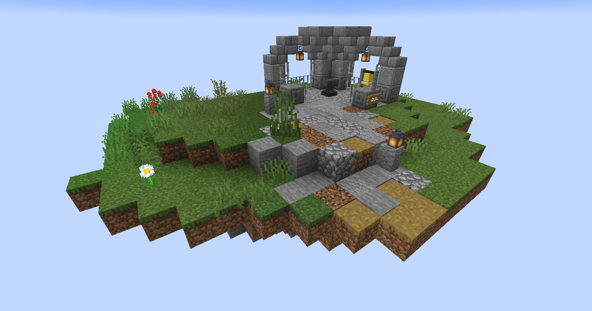

On the edge of the map you'll find a small island with a tiny workshop. From time to time a zombie villager will spawn here. Bring a potion and a nice Golden Apple as a snack. In no time you'll meet [Kovak](bosses.md#kovak) and earn yourself the [An Apple a Day](advancements.md#an-apple-a-day) advancement. He is able to change your gear to any type of material you want for the small price one Titanshard.

## The Labyrinth

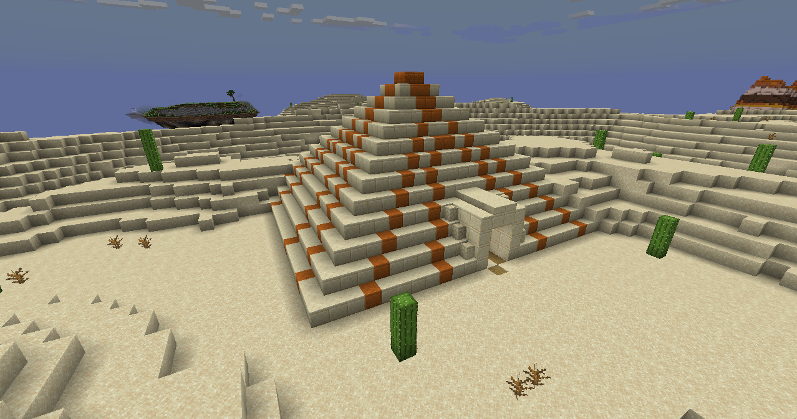

One of the larger structures will be the Desert Temple. Inside this tomb you'll find yourself stuck in a massive labyrinth filled with boobytraps and ofcourse some amazing loot. making it out alive for the first time will earn you the [Escape Alive](advancements.md#escape-alive) advancement. If you want to feel like Indiana Jones this is defintily the place to go.

## The Mansion

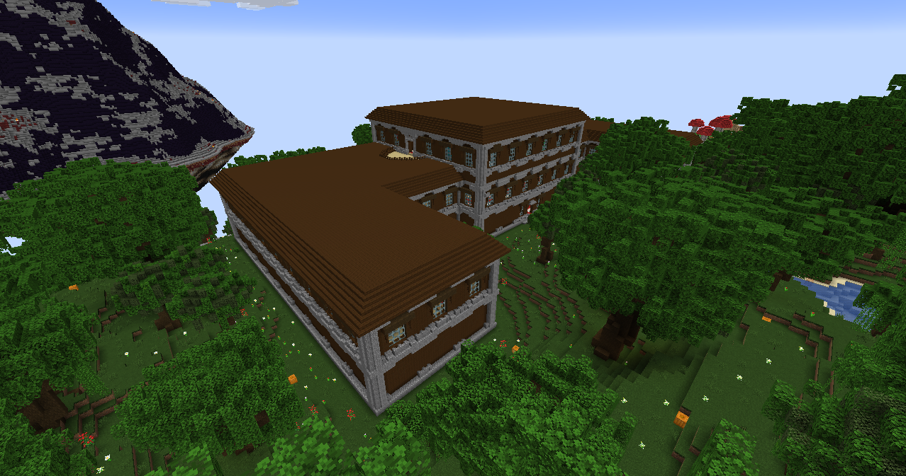

The largest structure in the Above is the Mansion. Similar to regurlar Mansions in the Overworld, you'll find all kinds of Illager have made their home inside. Fighting through hordes of these Illagers you can make your way to the top floor where the Illagers have messed up the picture on the round table. Can you match it up with a similar picture around the Mansion?

  
Guide to the puzzle

  
  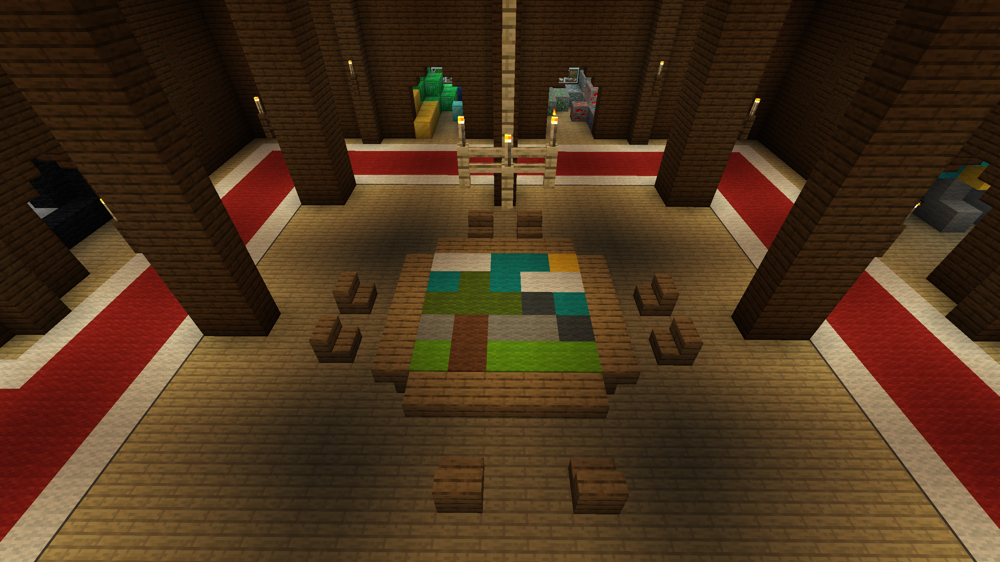

## Witch's Hut

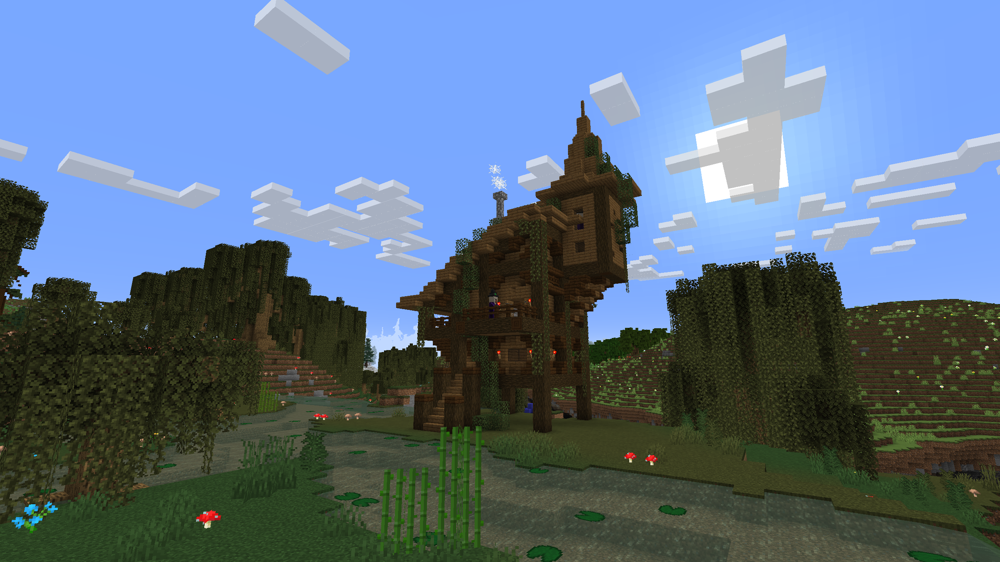

Located in the Swamp you can find this crooked hut. Walking around there are lots of witches here, but they are just apprentices to the one hiding in the tower. [Gamore](bosses.md#gamora) is up to no good brewing all sorts of potions here. Will you fall to her magic or can you endure and come out victorious?

## Broodmother's Den

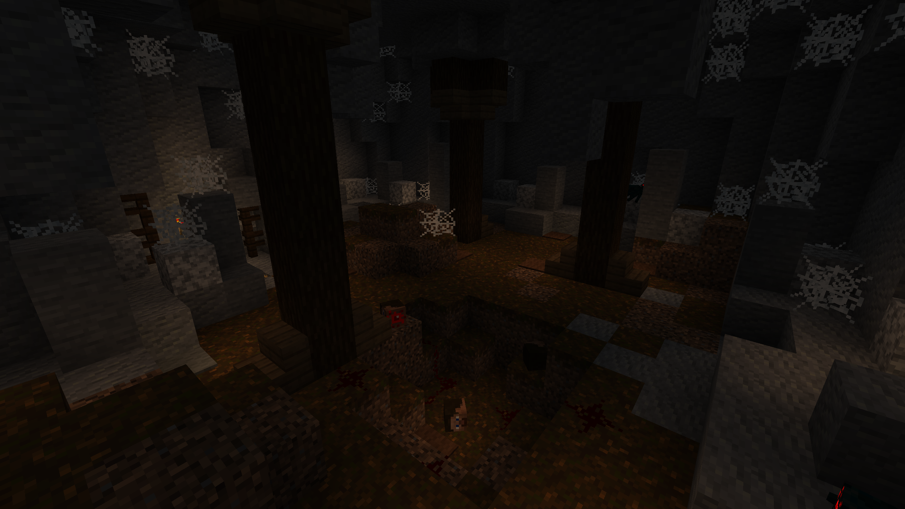

Inside this cobweb filled cave you'll find hordes of spider spinning their webs waiting to trap you. If you dare make your way deep inside this cave you can find the [Broodmother](bosses.md#broodmother) herself. Enter at your own risk and face all these spiders, or find the back entrance and slay her without alerting her minions.

## Ice Cavern

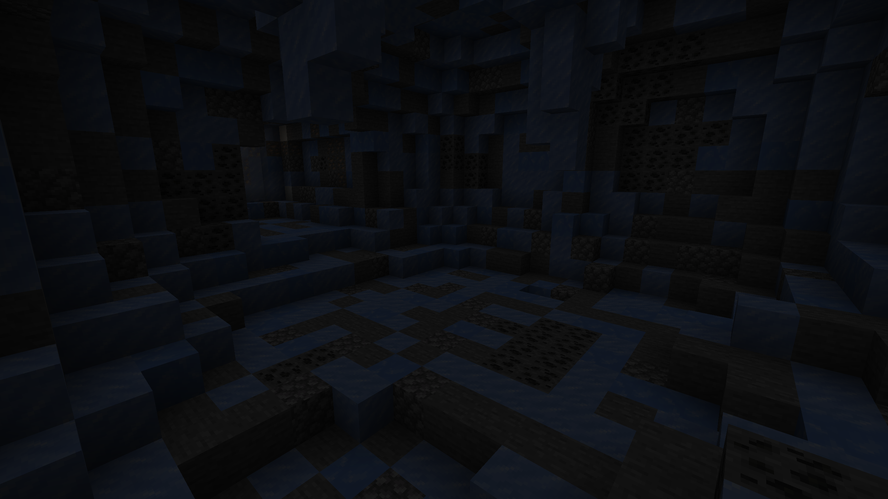

The snow filled tundra holds many secrets. Traversing this cold landscape can be harsh so finding shelter in a cave seems like a good idea. Not all caves are as save as they seem to be. If you stumble across a specifici one you'll find [Kermode](bosses.md#kermode) has made his home here. Better keep your sword ready, this bear might be too much for just fists too handle... Or is he?

## Ice Boat Raceway

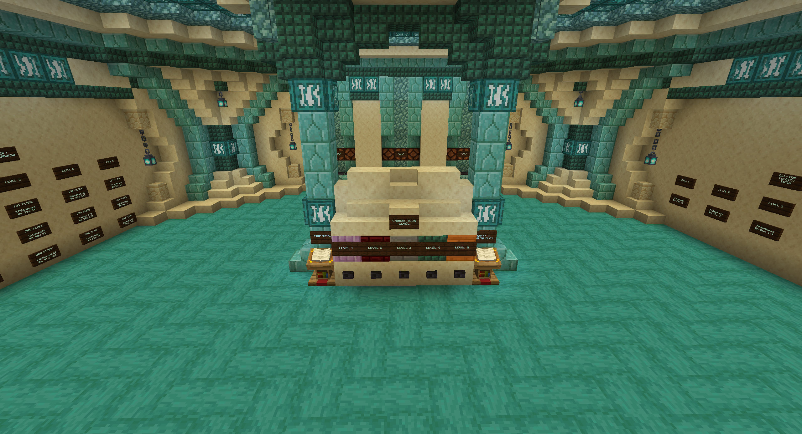

If you can find this seemingly regular cave, you'll discover that inside it's a lot larger then it appears on the outside. You'll be able to compete for the fastests time on 5 different courses. Will you make the weekly leaderboard or can you claim the fastest time overall? Try you skills at boat racing and see who deserves the title of the Fastest Titancraft Boat Racer.

## Queen Bee's Beehive

Below a large oak tree you can find a large beehive filled with honey. All the bees in the area make their home here in this Flower Forest. Often you'll be able to find the [Queen Bee](bosses.md#bee-queen) herself.

## Car Lot

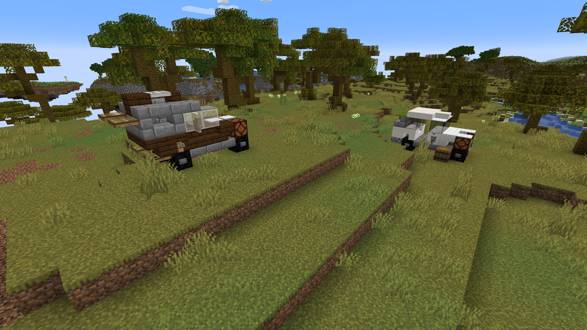

What are two abandoned cars doing in the Above? You can try you hand at being a car burglar, but be careful. [Von Feind](bosses.md#von-feind) might be lurking around ready to chop your head off!

## Spider's Den

Unlike the Broodmother's Den, thespiders inside this passage are not your average spiders. Traverse at your own risk and see if you can light up the entire passage to be able to find your treasure.

## The UFO

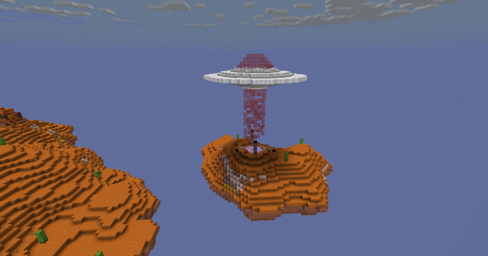

Around the edge of the map you'll find some weird looking blocks buried in the ground. If you're not careful you can sometimes come accross a UFO passing through the area. Do you dare getting close? If you do, you might get the [Close Encounter](advancements.md#close-encounter) advancement.

## Golden Fortress

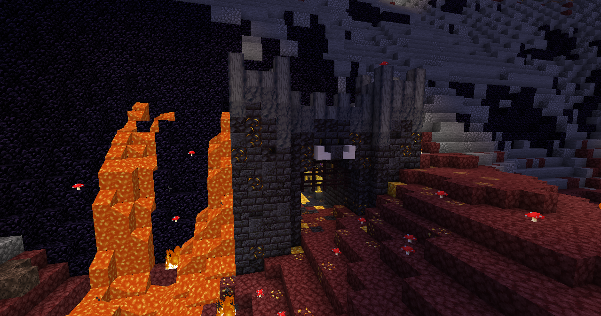

Inside the side of the Volcano you'll find a this fortress. Inside there are statues scattered around the place. These statues are really intriguing. They almost seem alive and maybe you'll find someone you know being immortalized here in Gold. Will you be added to this gallery? Try you luck inside and see if you can defeat [Midas](bosses.md#midas)

## The Citadel

A new addition to the Above. This imposing tower looms imposingly near the Volcano. Inside you'll need to offer some souls to explore further inside. Explore the inside at your own risk, or face the wrath of the [Fallen one](bosses.md#fallen-one)
